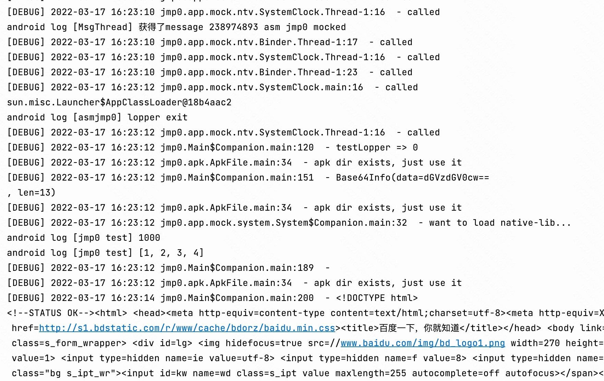
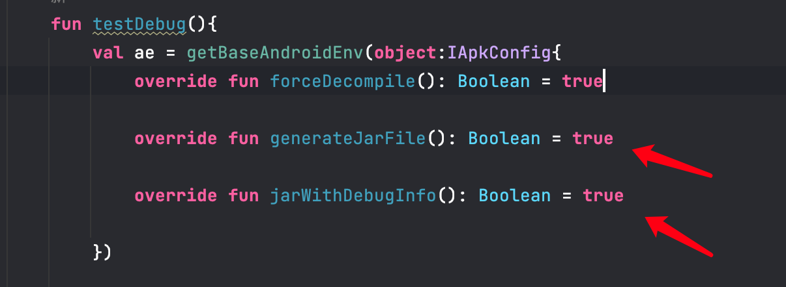
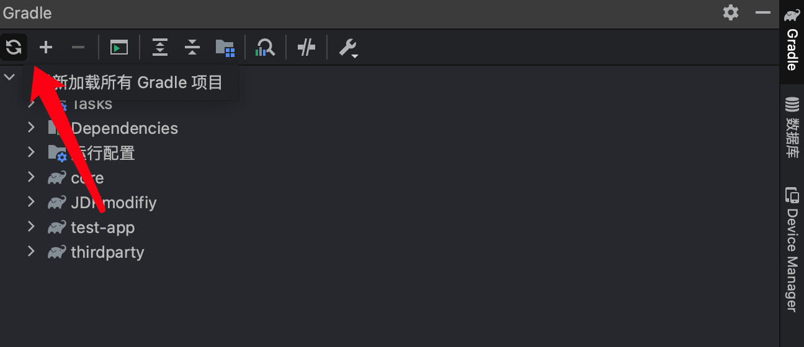
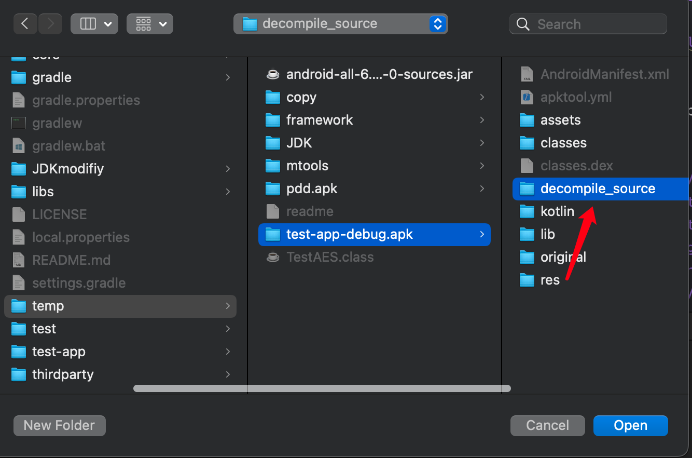
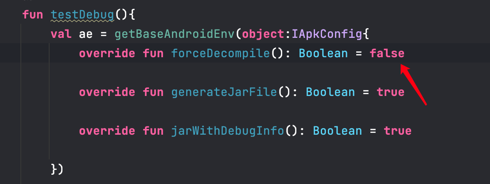
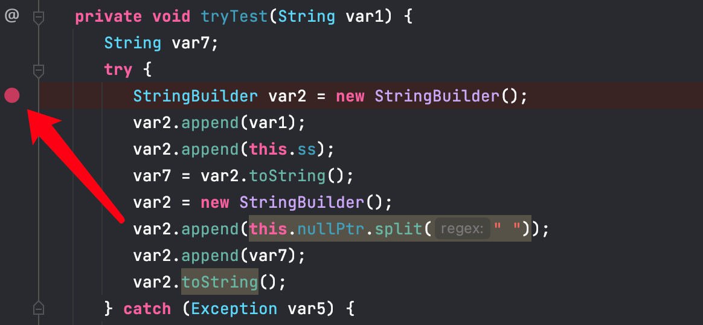

# Appdbg
make it possible to run android dex file in original Java Virtual Machine.

## Features
- change every class before it will be loaded
- change every item of the class after it was loaded
- hook java method
- implement native method by yourself or [unidbg](https://github.com/zhkl0228/unidbg)...
- provide fake source line level debug ability powered by fernflower!!!

## Start

- **only test fully with jdk 1.8 on OSX!!!**

1. open the project with IDEA

2. add vm option => -Xverify:none

3. patch jdk_path/...../libjvm.dylib,which make it possible to load class,the name begin with "java"

4. use the jre you modified(**or use jdk in [appdbg-JDK](https://github.com/asmjmp0/appdbg-JDK)**)

5. **exclude temp dir at project root dir.(if it exist)** 

5. change idea settings
- set gradle jdk version with the patched jdk 

- set gradle java home with the patched jdk in [gradle.properties](gradle.properties)

6. **io redirect feature need the rt.jar generated in [JDKmodifiy](JDKmodifiy)**

7. build test apk by [test-app sub project](test-app)

8. run [main](core/src/main/java/jmp0/Main.kt)
   

## Publish to mavenLocal
1. run command ` ./gradlew publishToMavenLocal`
2. `implementation "jmp0.appdbg:core:1.0-SNAPSHOT"`
## Implement native method with unidbg
**auto implement reflection method by appdbg**
- invoke method 

- native code source
  

- result

  
## source line level debug
1. implement IApkConfig and set generateJarFile and jarWithDebugInfo **true**,run code,and the jar file will be generated in libs/tempLibs dir

2. sync gradle file,and IDEA will index it

3. select one file you want to debug,and click the label.

4. chose the source files generated at temp/**apkName**/decompile_source, click **open** button.

5. set IApkConfig forceDecompile **false**,and set source line breakpoint.

6. run code with **debug mode**!!!

## About
it's hard for me to implement all Android runtime well，if you can help me to make this project better,Thanks for your contribution. 

## Thanks
- [robolectric](https://github.com/robolectric/robolectric)
- [dex2jar](https://github.com/pxb1988/dex2jar)
- [Apktool](https://github.com/iBotPeaches/Apktool)
- [javassist](https://github.com/jboss-javassist/javassist)
- [unidbg](https://github.com/zhkl0228/unidbg)
- [fernflower](https://github.com/fesh0r/fernflower)